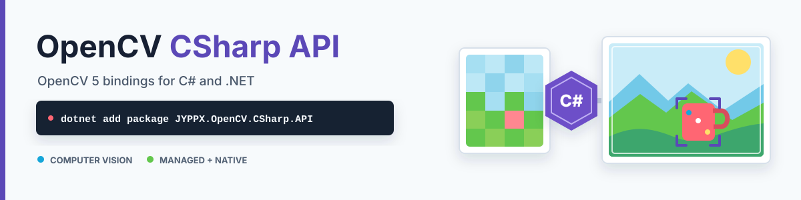

<picture>
  <source media="(prefers-color-scheme: dark)" srcset="docs/images/readme/hero-dark.svg">
  <source media="(prefers-color-scheme: light)" srcset="docs/images/readme/hero-light.svg">
  
</picture>

<h1 align="center">📷 OpenCV CSharp API</h1>

<p align="center">
  面向 C# 与 .NET 的版本中立 OpenCV 5.0 封装，提供 managed API 和经过验证的 native runtime 包。
</p>

<p align="center">
  <a href="https://www.nuget.org/packages/JYPPX.OpenCV.CSharp.API/"></a>
  <a href="https://www.nuget.org/packages/JYPPX.OpenCV.CSharp.API/"></a>
  <a href="https://github.com/guojin-yan/OpenCV-CSharp-API/releases"></a>
  <a href="https://github.com/guojin-yan/OpenCV-CSharp-API/stargazers"></a>
  <a href="LICENSE"></a>
</p>

<p align="center">
  <a href="https://github.com/guojin-yan/OpenCV-CSharp-API/actions/workflows/build-managed.yml"></a>
  <a href="https://github.com/guojin-yan/OpenCV-CSharp-API/actions/workflows/build-native.yml"></a>
</p>

<p align="center"><a href="README.md">English</a> | <strong>简体中文</strong></p>

## 📖 项目简介

OpenCV CSharp API 通过熟悉的 `JYPPX.OpenCvSharp.*` 命名空间，将 [OpenCV 5.0](https://opencv.org/) 引入 C#。项目提供符合 .NET 使用习惯的 managed API、稳定的 native C ABI、明确的 native 资源所有权，以及面向已验证 Windows、Linux 和 Android 模拟器目标的 runtime NuGet 包。

当前公开版本由下方 NuGet 实时徽章显示。稳定版按照语义化版本规则维护已声明 managed API 与 native ABI 的兼容性，并持续增加兼容的计算机视觉能力。

## ✨ 版本亮点

- 广泛覆盖 Core、ImgProc、ImgCodecs、VideoIO、Calib3D、DNN、Features、ObjDetect、Photo、Video、HighGui、Stitching、ML、Tracking 和部分 contrib API。
- 一个 managed 包，以及面向 14 个已验证 Windows、Linux 和 Android 模拟器 RID 的 full 与 mini native runtime profile。
- 支持 .NET Framework 4.6 至 4.8.1、.NET Core 3.1，以及 .NET 5 至 .NET 10。
- 向 NuGet.org 与 GitHub Packages 发布确定性包，并提供 SPDX 2.3 SBOM、受保护的发布审批和经过验证的 GitHub Release 产物。
- managed codec 预检可识别常见图像头，并在 native 解码前应用输入、尺寸、像素数和帧数预算。
- 提供 23 个按功能分组的无头完整案例并生成可检查 PNG；模型 DNN 案例使用一次性哈希校验资产包，其余案例完全离线运行。
- 兼容性基线覆盖 644 个 public managed type、6,963 个 public/protected member、`JYPPX.OpenCvSharp` 根下的 41 个 namespace 和已声明的 native ABI。

## 📢 5.0.0 本次更新

- 新增精确包版本诊断、更完整的颜色转换、非连续 `Mat` 行/stride 安全访问、类型化像素向量和类型安全的图像编码参数。
- 新增 `VideoCapture.TryRead`/`TryRetrieve`，以及由 OpenCV 原生实现的普通、按类别批量、旋转框和 Soft-NMS 检测后处理。
- 完善 runtime/package 验证流程、分组案例、系列教程，以及 NuGet.org、GitHub Packages 和 GitHub Release 的 Repository signing 核验。

参见 [5.0.0 详细说明](docs/releases/5.0.0.md)或完整的[版本变更总览](CHANGELOG.md)。公开可用状态以 NuGet 实时徽章、GitHub Packages 页面和对应 GitHub Release 为准。

## 🚀 30 秒快速开始

### 1. 安装 NuGet 包

安装 managed API 和一个 runtime 包，并确保二者使用相同版本。以下示例选择 Windows x64 full runtime：

```powershell
dotnet add package JYPPX.OpenCV.CSharp.API
dotnet add package JYPPX.OpenCV.runtime.win-x64 # 当前 Windows x64 示例
```

### 2. 编写 C# 代码

根据 OpenCV 模块使用对应的命名空间：

```csharp
using System;
using JYPPX.OpenCvSharp.Core;
using CoreCv2 = JYPPX.OpenCvSharp.Core.Cv2;

using Mat left = new Mat(2, 3, MatType.CV_8UC1);
using Mat right = new Mat(2, 3, MatType.CV_8UC1);
using Mat result = new Mat();

left.CopyFrom(new byte[] { 1, 2, 3, 4, 5, 6 });
right.CopyFrom(new byte[] { 6, 5, 4, 3, 2, 1 });
CoreCv2.Add(left, right, result);

Console.WriteLine(string.Join(",", result.ToBytes()));
```

### 3. 运行程序

```powershell
dotnet run
```

预期输出：

```text
7,7,7,7,7,7
```

完整的[快速开始](docs/articles/quick-start.md)包含 package 选择、Mat、图像编解码、几何运算和确定性资源释放说明。

## 📦 NuGet 包

### Managed API

| 包 | 版本 | NuGet.org | GitHub Packages | 用途 |
| --- | --- | --- | --- | --- |
| `JYPPX.OpenCV.CSharp.API` | [](https://www.nuget.org/packages/JYPPX.OpenCV.CSharp.API/) | [NuGet Gallery](https://www.nuget.org/packages/JYPPX.OpenCV.CSharp.API/) | [包页面](https://github.com/users/guojin-yan/packages/nuget/package/JYPPX.OpenCV.CSharp.API) | 面向全部受支持 .NET target 的版本中立 managed API |

### 发布渠道

| 渠道 | 公开入口 | 发布内容 |
| --- | --- | --- |
| NuGet.org | [JYPPX.OpenCV.CSharp.API](https://www.nuget.org/packages/JYPPX.OpenCV.CSharp.API/) | managed API 和当前全部已验证 runtime 包 |
| GitHub Packages | [JYPPX.OpenCV.CSharp.API](https://github.com/users/guojin-yan/packages/nuget/package/JYPPX.OpenCV.CSharp.API) | 与审核 candidate 字节完全一致的 managed 与 runtime 包 |
| GitHub Releases | [OpenCV-CSharp-API Releases](https://github.com/guojin-yan/OpenCV-CSharp-API/releases) | Repository-signed 包、SBOM、manifest 和验证报告 |

Full runtime 使用版本中立规则 `JYPPX.OpenCV.runtime.<rid>`；mini runtime 使用 `JYPPX.OpenCV.runtime.<rid>.mini`。

请根据 target RID 和所需 profile 选择对应的 runtime 包。

full profile 保证包含矩阵要求的模块，包括 DNN、ML、标定、Features、Photo、Video、HighGui 和 Stitching。Tracking 和部分 contrib 模块属于按实际构建暂存的可选模块：managed API 保持稳定，native 功能不可用时返回 `NOT_LINKED`。mini profile 聚焦 `core`、`imgproc`、`imgcodecs`、`videoio`，并包含必需的 `geometry` 与 `flann` 依赖。修正 Full/ML 边界之前发布的旧包可能对 ML 返回 `NOT_LINKED`，ML 工作负载应使用最新 Full runtime。

不要同时引用 full 与 mini runtime 包。managed 和 runtime 包必须使用同一个 NuGet 规范版本。

启动诊断时，`OpenCvSharpBuildInfo.NuGetPackageVersion` 返回包含 `preview.N` 在内的精确规范包版本；`OpenCvSharpBuildInfo.NativeAbiVersion` 与 `GetLoadedNativeAbiVersion()` 用于确认 managed/native ABI 组合。runtime 加载后调用 `VerifyNativeRuntimeCompatibility()`，可以在 managed 包、native ABI 或 OpenCV 版本不匹配时立即失败。

## 🧩 Native Runtime 包

每个版本都发布 managed 包，以及 [`runtime-support-contract.json`](packaging/runtime/runtime-support-contract.json) 中全部归类为 `realSupport` 的 runtime 包。每个包都从同一份审核通过的 candidate 推送到两个公开 registry；正式发布产物与验证证据同时发布在 [GitHub Releases](https://github.com/guojin-yan/OpenCV-CSharp-API/releases)。

| 平台 | 架构 | Full runtime | Mini runtime |
| --- | --- | --- | --- |
| Windows 10/11 | x64 | `JYPPX.OpenCV.runtime.win-x64`<br>[](https://www.nuget.org/packages/JYPPX.OpenCV.runtime.win-x64/)<br>[NuGet.org](https://www.nuget.org/packages/JYPPX.OpenCV.runtime.win-x64/) / [GitHub](https://github.com/users/guojin-yan/packages/nuget/package/JYPPX.OpenCV.runtime.win-x64) | `JYPPX.OpenCV.runtime.win-x64.mini`<br>[](https://www.nuget.org/packages/JYPPX.OpenCV.runtime.win-x64.mini/)<br>[NuGet.org](https://www.nuget.org/packages/JYPPX.OpenCV.runtime.win-x64.mini/) / [GitHub](https://github.com/users/guojin-yan/packages/nuget/package/JYPPX.OpenCV.runtime.win-x64.mini) |
| Windows 10/11 (WoW64) | x86 | `JYPPX.OpenCV.runtime.win-x86`<br>[](https://www.nuget.org/packages/JYPPX.OpenCV.runtime.win-x86/)<br>[NuGet.org](https://www.nuget.org/packages/JYPPX.OpenCV.runtime.win-x86/) / [GitHub](https://github.com/users/guojin-yan/packages/nuget/package/JYPPX.OpenCV.runtime.win-x86) | 已排除（`win-x86/mini`） |
| Windows 11 | ARM64 | `JYPPX.OpenCV.runtime.win-arm64`<br>[](https://www.nuget.org/packages/JYPPX.OpenCV.runtime.win-arm64/)<br>[NuGet.org](https://www.nuget.org/packages/JYPPX.OpenCV.runtime.win-arm64/) / [GitHub](https://github.com/users/guojin-yan/packages/nuget/package/JYPPX.OpenCV.runtime.win-arm64) | `JYPPX.OpenCV.runtime.win-arm64.mini`<br>[](https://www.nuget.org/packages/JYPPX.OpenCV.runtime.win-arm64.mini/)<br>[NuGet.org](https://www.nuget.org/packages/JYPPX.OpenCV.runtime.win-arm64.mini/) / [GitHub](https://github.com/users/guojin-yan/packages/nuget/package/JYPPX.OpenCV.runtime.win-arm64.mini) |
| Android 7.0+ 模拟器 | x86_64 | `JYPPX.OpenCV.runtime.android-x64`<br>[](https://www.nuget.org/packages/JYPPX.OpenCV.runtime.android-x64/)<br>[NuGet.org](https://www.nuget.org/packages/JYPPX.OpenCV.runtime.android-x64/) / [GitHub](https://github.com/users/guojin-yan/packages/nuget/package/JYPPX.OpenCV.runtime.android-x64) | `JYPPX.OpenCV.runtime.android-x64.mini`<br>[](https://www.nuget.org/packages/JYPPX.OpenCV.runtime.android-x64.mini/)<br>[NuGet.org](https://www.nuget.org/packages/JYPPX.OpenCV.runtime.android-x64.mini/) / [GitHub](https://github.com/users/guojin-yan/packages/nuget/package/JYPPX.OpenCV.runtime.android-x64.mini) |
| Android 7.0+ 模拟器 | x86 | `JYPPX.OpenCV.runtime.android-x86`<br>[](https://www.nuget.org/packages/JYPPX.OpenCV.runtime.android-x86/)<br>[NuGet.org](https://www.nuget.org/packages/JYPPX.OpenCV.runtime.android-x86/) / [GitHub](https://github.com/users/guojin-yan/packages/nuget/package/JYPPX.OpenCV.runtime.android-x86) | `JYPPX.OpenCV.runtime.android-x86.mini`<br>[](https://www.nuget.org/packages/JYPPX.OpenCV.runtime.android-x86.mini/)<br>[NuGet.org](https://www.nuget.org/packages/JYPPX.OpenCV.runtime.android-x86.mini/) / [GitHub](https://github.com/users/guojin-yan/packages/nuget/package/JYPPX.OpenCV.runtime.android-x86.mini) |
| Ubuntu 22.04 | x64 | `JYPPX.OpenCV.runtime.ubuntu.22.04-x64`<br>[](https://www.nuget.org/packages/JYPPX.OpenCV.runtime.ubuntu.22.04-x64/)<br>[NuGet.org](https://www.nuget.org/packages/JYPPX.OpenCV.runtime.ubuntu.22.04-x64/) / [GitHub](https://github.com/users/guojin-yan/packages/nuget/package/JYPPX.OpenCV.runtime.ubuntu.22.04-x64) | `JYPPX.OpenCV.runtime.ubuntu.22.04-x64.mini`<br>[](https://www.nuget.org/packages/JYPPX.OpenCV.runtime.ubuntu.22.04-x64.mini/)<br>[NuGet.org](https://www.nuget.org/packages/JYPPX.OpenCV.runtime.ubuntu.22.04-x64.mini/) / [GitHub](https://github.com/users/guojin-yan/packages/nuget/package/JYPPX.OpenCV.runtime.ubuntu.22.04-x64.mini) |
| Ubuntu 22.04 | ARM64 | `JYPPX.OpenCV.runtime.ubuntu.22.04-arm64`<br>[](https://www.nuget.org/packages/JYPPX.OpenCV.runtime.ubuntu.22.04-arm64/)<br>[NuGet.org](https://www.nuget.org/packages/JYPPX.OpenCV.runtime.ubuntu.22.04-arm64/) / [GitHub](https://github.com/users/guojin-yan/packages/nuget/package/JYPPX.OpenCV.runtime.ubuntu.22.04-arm64) | `JYPPX.OpenCV.runtime.ubuntu.22.04-arm64.mini`<br>[](https://www.nuget.org/packages/JYPPX.OpenCV.runtime.ubuntu.22.04-arm64.mini/)<br>[NuGet.org](https://www.nuget.org/packages/JYPPX.OpenCV.runtime.ubuntu.22.04-arm64.mini/) / [GitHub](https://github.com/users/guojin-yan/packages/nuget/package/JYPPX.OpenCV.runtime.ubuntu.22.04-arm64.mini) |
| Ubuntu 24.04 | x64 | `JYPPX.OpenCV.runtime.ubuntu.24.04-x64`<br>[](https://www.nuget.org/packages/JYPPX.OpenCV.runtime.ubuntu.24.04-x64/)<br>[NuGet.org](https://www.nuget.org/packages/JYPPX.OpenCV.runtime.ubuntu.24.04-x64/) / [GitHub](https://github.com/users/guojin-yan/packages/nuget/package/JYPPX.OpenCV.runtime.ubuntu.24.04-x64) | `JYPPX.OpenCV.runtime.ubuntu.24.04-x64.mini`<br>[](https://www.nuget.org/packages/JYPPX.OpenCV.runtime.ubuntu.24.04-x64.mini/)<br>[NuGet.org](https://www.nuget.org/packages/JYPPX.OpenCV.runtime.ubuntu.24.04-x64.mini/) / [GitHub](https://github.com/users/guojin-yan/packages/nuget/package/JYPPX.OpenCV.runtime.ubuntu.24.04-x64.mini) |
| Ubuntu 24.04 | ARM64 | `JYPPX.OpenCV.runtime.ubuntu.24.04-arm64`<br>[](https://www.nuget.org/packages/JYPPX.OpenCV.runtime.ubuntu.24.04-arm64/)<br>[NuGet.org](https://www.nuget.org/packages/JYPPX.OpenCV.runtime.ubuntu.24.04-arm64/) / [GitHub](https://github.com/users/guojin-yan/packages/nuget/package/JYPPX.OpenCV.runtime.ubuntu.24.04-arm64) | `JYPPX.OpenCV.runtime.ubuntu.24.04-arm64.mini`<br>[](https://www.nuget.org/packages/JYPPX.OpenCV.runtime.ubuntu.24.04-arm64.mini/)<br>[NuGet.org](https://www.nuget.org/packages/JYPPX.OpenCV.runtime.ubuntu.24.04-arm64.mini/) / [GitHub](https://github.com/users/guojin-yan/packages/nuget/package/JYPPX.OpenCV.runtime.ubuntu.24.04-arm64.mini) |
| Debian 12 | x64 | `JYPPX.OpenCV.runtime.debian.12-x64`<br>[](https://www.nuget.org/packages/JYPPX.OpenCV.runtime.debian.12-x64/)<br>[NuGet.org](https://www.nuget.org/packages/JYPPX.OpenCV.runtime.debian.12-x64/) / [GitHub](https://github.com/users/guojin-yan/packages/nuget/package/JYPPX.OpenCV.runtime.debian.12-x64) | `JYPPX.OpenCV.runtime.debian.12-x64.mini`<br>[](https://www.nuget.org/packages/JYPPX.OpenCV.runtime.debian.12-x64.mini/)<br>[NuGet.org](https://www.nuget.org/packages/JYPPX.OpenCV.runtime.debian.12-x64.mini/) / [GitHub](https://github.com/users/guojin-yan/packages/nuget/package/JYPPX.OpenCV.runtime.debian.12-x64.mini) |
| Debian 12 | ARM64 | `JYPPX.OpenCV.runtime.debian.12-arm64`<br>[](https://www.nuget.org/packages/JYPPX.OpenCV.runtime.debian.12-arm64/)<br>[NuGet.org](https://www.nuget.org/packages/JYPPX.OpenCV.runtime.debian.12-arm64/) / [GitHub](https://github.com/users/guojin-yan/packages/nuget/package/JYPPX.OpenCV.runtime.debian.12-arm64) | `JYPPX.OpenCV.runtime.debian.12-arm64.mini`<br>[](https://www.nuget.org/packages/JYPPX.OpenCV.runtime.debian.12-arm64.mini/)<br>[NuGet.org](https://www.nuget.org/packages/JYPPX.OpenCV.runtime.debian.12-arm64.mini/) / [GitHub](https://github.com/users/guojin-yan/packages/nuget/package/JYPPX.OpenCV.runtime.debian.12-arm64.mini) |
| Fedora 40 | x64 | `JYPPX.OpenCV.runtime.fedora.40-x64`<br>[](https://www.nuget.org/packages/JYPPX.OpenCV.runtime.fedora.40-x64/)<br>[NuGet.org](https://www.nuget.org/packages/JYPPX.OpenCV.runtime.fedora.40-x64/) / [GitHub](https://github.com/users/guojin-yan/packages/nuget/package/JYPPX.OpenCV.runtime.fedora.40-x64) | `JYPPX.OpenCV.runtime.fedora.40-x64.mini`<br>[](https://www.nuget.org/packages/JYPPX.OpenCV.runtime.fedora.40-x64.mini/)<br>[NuGet.org](https://www.nuget.org/packages/JYPPX.OpenCV.runtime.fedora.40-x64.mini/) / [GitHub](https://github.com/users/guojin-yan/packages/nuget/package/JYPPX.OpenCV.runtime.fedora.40-x64.mini) |
| RHEL 9 / UBI 9 | x64 | `JYPPX.OpenCV.runtime.rhel.9-x64`<br>[](https://www.nuget.org/packages/JYPPX.OpenCV.runtime.rhel.9-x64/)<br>[NuGet.org](https://www.nuget.org/packages/JYPPX.OpenCV.runtime.rhel.9-x64/) / [GitHub](https://github.com/users/guojin-yan/packages/nuget/package/JYPPX.OpenCV.runtime.rhel.9-x64) | `JYPPX.OpenCV.runtime.rhel.9-x64.mini`<br>[](https://www.nuget.org/packages/JYPPX.OpenCV.runtime.rhel.9-x64.mini/)<br>[NuGet.org](https://www.nuget.org/packages/JYPPX.OpenCV.runtime.rhel.9-x64.mini/) / [GitHub](https://github.com/users/guojin-yan/packages/nuget/package/JYPPX.OpenCV.runtime.rhel.9-x64.mini) |
| Rocky Linux 9 | x64 | `JYPPX.OpenCV.runtime.rocky.9-x64`<br>[](https://www.nuget.org/packages/JYPPX.OpenCV.runtime.rocky.9-x64/)<br>[NuGet.org](https://www.nuget.org/packages/JYPPX.OpenCV.runtime.rocky.9-x64/) / [GitHub](https://github.com/users/guojin-yan/packages/nuget/package/JYPPX.OpenCV.runtime.rocky.9-x64) | `JYPPX.OpenCV.runtime.rocky.9-x64.mini`<br>[](https://www.nuget.org/packages/JYPPX.OpenCV.runtime.rocky.9-x64.mini/)<br>[NuGet.org](https://www.nuget.org/packages/JYPPX.OpenCV.runtime.rocky.9-x64.mini/) / [GitHub](https://github.com/users/guojin-yan/packages/nuget/package/JYPPX.OpenCV.runtime.rocky.9-x64.mini) |
| Alpine 3.20 | x64 / musl | `JYPPX.OpenCV.runtime.alpine.3.20-x64`<br>[](https://www.nuget.org/packages/JYPPX.OpenCV.runtime.alpine.3.20-x64/)<br>[NuGet.org](https://www.nuget.org/packages/JYPPX.OpenCV.runtime.alpine.3.20-x64/) / [GitHub](https://github.com/users/guojin-yan/packages/nuget/package/JYPPX.OpenCV.runtime.alpine.3.20-x64) | `JYPPX.OpenCV.runtime.alpine.3.20-x64.mini`<br>[](https://www.nuget.org/packages/JYPPX.OpenCV.runtime.alpine.3.20-x64.mini/)<br>[NuGet.org](https://www.nuget.org/packages/JYPPX.OpenCV.runtime.alpine.3.20-x64.mini/) / [GitHub](https://github.com/users/guojin-yan/packages/nuget/package/JYPPX.OpenCV.runtime.alpine.3.20-x64.mini) |

Linux runtime 包使用 distro-specific Linux RID，不使用模糊的通用 `linux-x64` 身份。如果 .NET SDK 无法识别项目定义的 RID，请将 `RuntimeIdentifierGraphPath` 指向 [`packaging/runtime/runtime-distro-rid-graph.json`](packaging/runtime/runtime-distro-rid-graph.json)，或在 restore 前把该文件复制到 consumer 项目。

Windows x86 Full 已通过正式 hosted WoW64 producer、artifact、package、PE/I386 闭包与 X86 consumer 证据并归类为 `realSupport`；Windows x86 Mini 仍被排除。Android x64/x86 的 Full 与 Mini 已通过正式单加载器 NDK 构建、包与 APK 审计，以及模拟器内 `Mat` 加 `Cv2.Sum` 原生加载，现已归类为 `realSupport`；已淘汰的双加载器运行记录保留在 [`android-runtime-evidence.json`](packaging/runtime/android-runtime-evidence.json) 的 `superseded` 区域。Android ARM/ARM64 的 Full 与 Mini 仍为 `android-evidence-pending`：其托管生产和包证据已经通过，但在晋升前仍需 ABI 匹配的真机加载证据。macOS 位于声明的 runtime package matrix 之外。矩阵中存在某一行，不等于项目对该平台作出正式支持承诺。

如果 no matching runtime package，请使用 `scripts/Build-OpenCV.ps1` 构建 local native runtime，再通过 `scripts/Stage-Runtime.ps1 -OpenCvNativeRuntimeDir <path>` 暂存，并用 `OpenCvNativeRuntimeDir` 将本地示例或测试指向该目录。对应 package fallback 命令为 `Pack-Runtime.ps1 -StageRuntime -OpenCvNativeRuntimeDir <runtime-native-dir>`。完整流程见 [Linked Runtime 构建指南](docs/articles/linked-runtime-build-guide.md)。

## ⚖️ 选择 Full 或 Mini

| 能力 | Full | Mini |
| --- | :---: | :---: |
| Core 数组、Mat、持久化 | 支持 | 支持 |
| ImgProc、ImgCodecs、VideoIO | 支持 | 支持 |
| Geometry 与 FLANN runtime 依赖 | 支持 | 支持 |
| DNN、目标检测、标定、特征 | 支持 | 不支持 |
| Photo、Video、HighGui、Stitching | 支持 | 不支持 |
| ML | 支持 | 不支持 |
| Tracking、部分 contrib 模块 | 取决于 runtime | 不支持 |
| 模块不可用时的稳定响应 | `NOT_LINKED` | `NOT_LINKED` |

## 🧪 系列教程与可视化结果

[`samples/ConsoleSamples`](samples/ConsoleSamples) 包含广覆盖 smoke 和原有 6 个可在无头环境运行的展示流程；扩展后的分组案例见 [`samples/README.md`](samples/README.md)。设置中文字体路径后可运行完整展示，其中包含通过 OpenCV `putText` 绘制中文：

```powershell
$env:OPENCV_CSHARP_CJK_FONT = "C:\path\to\a-cjk-font.ttf"
dotnet run --project .\samples\ConsoleSamples\ConsoleSamples.csproj -c Release `
  -p:OpenCvNativeRuntimeDir=E:\path\to\full-runtime `
  -- tutorial all .\artifacts\tutorials
```

该命令会生成图像处理、OpenCV 原生中文写字、轮廓、ORB 特征、模板匹配和 KNN 分类结果：


建议从[系列教程](docs/articles/tutorial-series.md)开始。每个输出都对应一篇技术文章，其中包含可运行命令、核心代码、runtime profile 以及深入模块指南的链接。原 `showcase` 命令继续作为兼容别名。

[`samples`](samples) 是包含 23 个完整工作流的可持续扩展案例目录。图像处理、特征、几何、视频、跟踪、拼接、传统机器学习和深度学习分别使用独立编号子目录；完整案例、命令、输出和文章映射见 [`samples/README.md`](samples/README.md)，模型来源和校验下载见[案例模型资产](docs/articles/sample-model-assets-guide.md)。

学习时只运行当前功能对应的项目。每个案例都会恢复公开 managed API 和匹配的 runtime 夹具，完成一套功能流程，输出聚焦结果并打印包/native 构建信息。用于可复现验证的版本只维护在 `samples/SamplePackages.props`，普通安装命令不写死版本。

## 📚 文档

| 资源 | 说明 |
| --- | --- |
| [在线文档](https://guojin-yan.github.io/OpenCV-CSharp-API/) | API reference 和专题文章 |
| [快速开始](docs/articles/quick-start.md) | 安装并编写第一个程序 |
| [系列教程](docs/articles/tutorial-series.md) | 按功能分组的可执行案例及同步技术文章 |
| [案例目录](docs/articles/example-catalog.md) | 按功能分组运行 package-backed 案例 |
| [案例模型资产](docs/articles/sample-model-assets-guide.md) | 按固定来源、哈希和许可证下载模型 |
| [OpenCV 中文写字](docs/articles/tutorial-02-chinese-puttext.md) | 通过 OpenCV 5 `putText` 把 UTF-8 中文直接写入 `Mat` |
| [可视化案例](docs/articles/visual-showcase.md) | 输出图集与兼容命令 |
| [场景配方](docs/articles/scenario-recipes.md) | 面向任务的使用流程 |
| [Linked Runtime 构建指南](docs/articles/linked-runtime-build-guide.md) | 构建和暂存真实 native runtime |
| [Linked Runtime Smoke 指南](docs/articles/linked-runtime-smoke-guide.md) | 验证 native 加载与 package 执行 |
| [Smoke Profile 指南](docs/articles/smoke-profiles-guide.md) | 选择 full 或 mini 验证 |
| [Runtime License](docs/articles/runtime-licenses.md) | runtime 与第三方许可证 |
| [Runtime package README](packaging/runtime/JYPPX.OpenCV.runtime/README.md) | 包布局与 provenance |
| [API/ABI 兼容策略](docs/articles/api-abi-compatibility-policy.md) | 兼容性与 gap 统计 |
| [支持与生命周期策略](docs/articles/support-lifecycle-policy.md) | real、pending 与 excluded 目标 |
| [NuGet Repository Signing 指南](docs/articles/nuget-repository-signing-guide.md) | 发布信任和验证流程 |

## 🔧 从源码构建

环境要求：

- 仓库验证路径使用任意 .NET 10 SDK；根目录 `global.json` 允许在 .NET 10 内滚动选择。
- native 构建需要 CMake 和受支持的 C/C++ toolchain。
- linked native 构建需要 OpenCV 5.0.0 源码或已安装的 OpenCV 5.0.0 runtime。

```powershell
git clone https://github.com/guojin-yan/OpenCV-CSharp-API.git
cd OpenCV-CSharp-API
git switch opencv5.x

dotnet restore .\OpenCV-CSharp-API.slnx
dotnet build .\OpenCV-CSharp-API.slnx -c Release --no-restore
```

native 和 package 构建请使用 [Linked Runtime 构建指南](docs/articles/linked-runtime-build-guide.md)。synthetic runtime input 只用于验证 package shape，禁止发布。

## 🏗️ 项目结构

```text
OpenCV-CSharp-API/
|-- src/OpenCvSharp/                    Managed API
|-- src/OpenCvSharp.Native/             稳定 native C ABI
|-- samples/ConsoleSamples/             广覆盖 API smoke 与可视化图集
|-- samples/ImageProcessing/            图像处理案例（01..06）
|-- samples/Features/                   特征检测与匹配案例
|-- samples/Geometry/                   投影几何案例
|-- samples/Video/                      运动与时序案例
|-- samples/Tracking/                   有状态目标跟踪案例
|-- samples/Stitching/                  多图全景拼接案例
|-- samples/MachineLearning/            KNN 与 SVM 案例
|-- samples/DeepLearning/               ONNX 分类、检测与分割案例
|-- samples/Common/                     案例共享基础设施
|-- packaging/runtime/                  RID/profile runtime package 模板
|-- compatibility/                      API、ABI 与 upstream map
|-- docs/                               DocFX 配置与文章
|-- scripts/                            构建、打包、验证与发布 guard
`-- .github/workflows/                  CI、runtime 生产、打包与发布
```

## 🤝 参与贡献

欢迎提交 Issue 和 Pull Request。修改 public API、native ABI、package identity、所有权或 runtime 行为之前，请阅读 [CONTRIBUTING.md](CONTRIBUTING.md) 和 [API/ABI 兼容策略](docs/articles/api-abi-compatibility-policy.md)。

请提供聚焦测试，保持 public identity 版本中立，并明确记录无法支持的 upstream 行为。

## 🙏 致谢

本项目建立在 [OpenCV](https://opencv.org/) 及其社区贡献之上。算法行为和 native runtime 许可证以 OpenCV 上游内容为准。

## 📄 许可证

managed API、native wrapper 与 OpenCV runtime 均使用 [Apache License 2.0](LICENSE)，因此 managed 和 runtime NuGet 包统一使用 SPDX expression `Apache-2.0`；包内第三方 notice 对相应组件具有最终效力。

## 📮 技术支持与联系方式

- 通过 [GitHub Issues](https://github.com/guojin-yan/OpenCV-CSharp-API/issues) 报告 Bug 或提出功能建议。
- 通过 [GitHub Discussions](https://github.com/guojin-yan/OpenCV-CSharp-API/discussions) 交流使用问题。
- QQ 交流群：`945057948`。

`5.0.0` 是首个稳定版。用于生产、工业或关键任务系统前，请针对实际业务流程完成严格测试，尤其要关注与已发布证据矩阵不同的平台和 runtime 组合。

<p align="center">
  
</p>

## 📢 软件声明

**1. 开源协议声明**

作者所有开源项目代码均遵循 **Apache License 2.0** 开源协议。

*特别说明：本项目集成了若干第三方库。若任何第三方库的许可协议与 Apache 2.0 协议存在冲突或不一致，均以该第三方库的原始许可协议为准。本项目不包含也不代表这些第三方库的授权声明，使用前请务必阅读并遵守第三方库的相关许可。*

**2. 代码开发与质量说明**

- **AI 辅助开发**：本代码在开发过程中使用了人工智能（AI）辅助生成与优化，并非完全由人工逐行编写。
- **安全性承诺**：**作者郑重声明，本代码中绝无任何有意设置的后门、病毒、木马或旨在破坏用户设备、窃取数据的恶意代码。**
- **技术局限性**：受限于作者个人的技术水平与能力，代码中可能存在因逻辑不严谨、优化不足或经验欠缺导致的低级问题（例如但不限于内存泄漏、偶发崩溃、资源未释放等）。这些问题纯属能力不足所致，并非主观故意。
- **测试范围**：由于作者精力有限，未对本软件进行全方位、覆盖所有边缘场景的完整测试。

**3. 免责声明（重要）**

**请在将本代码应用于任何实际项目（特别是商业、工业或关键任务环境）之前，务必进行详尽、严格的自行测试与验证。** 鉴于上述可能存在的代码缺陷及测试覆盖不足，**因使用本代码而导致的任何直接或间接损失（包括但不限于设备故障、数据丢失、系统瘫痪或利润损失等），本作者概不负责。** 一旦您开始使用本代码，即表示您已知晓上述风险并同意自行承担一切后果，相关问题与本作者无关。

**4. 代码开源范围**

本项目承诺核心逻辑代码完全开源，但上述提到的“第三方库”的二进制文件、源代码或相关资源不在本项目的开源义务范围内，请根据其各自的指引获取。

**5. 社区与反馈**

尽管存在上述不足，我们仍欢迎大家下载使用、提交 Issue 或参与测试，共同完善项目。如果您在使用过程中发现 Bug、内存溢出或有改进建议，欢迎通过项目主页提供的联系方式与作者取得联系，我们将尽力在有限的时间内提供协助。

<details>
<summary>维护者构建与兼容边界</summary>

以下内容用于保留仓库审计约束。普通使用者应优先阅读上方链接的指南。

- native CMake 工程目前只支持 source-tree build，不安装或导出通用 CMake package/SDK target。唯一的 native target 和 loader identity 是 `JYPPX.OpenCV.Native`。
- runtime NuGet 包当前不分发 native C header。source-tree header surface 为 `src/OpenCvSharp.Native/include/open_cv_sharp`。
- native CTest 和本地输出命名保持版本中立：`JYPPX.OpenCV.NativeSmoke` 与 `JYPPX.OpenCV.NativeAbiExportAudit`。
- 本地 sample 与 test 使用 `OpenCvNativeRuntimeDir`；构建缺失 runtime 时将该属性指向本地 runtime 目录即可。
- managed build-info 公共接口为 `OpenCvSharpBuildInfo`；native interop 使用 `JYPPX.OpenCV.Native` 和 `jyppx_ocv_*` entry points。
- `runtime-input.yml` 生成真实 `runtime-input-<rid>-<profile>` artifact，内含 `native-wrapper/`、`opencv-runtime/` 与 `opencv-source/`。
- pack workflow 覆盖当前 multi-RID runtime package matrix 及 full/mini profile。synthetic job 只验证 package shape；可发布 job 要求真实输入与 consumer restore 验证。规范化 nupkg 输出位于 `artifacts/packages`。
- `pack.yml` 不构建真实 runtime input。真实输入必须已存在于 runner，或来自 `real_runtime_artifact_run_id`。synthetic runtime input 只验证 package surface；real publishable runtime packages require `SyntheticRuntimeInputs=false`。
- Before packing，使用 `-PackageVersion` 传入精确发布版本，并通过 `-OpenCvNativeRuntimeDir` 传入已暂存的真实 runtime。package IDs stay version-neutral；normalized `.nupkg` 写入 `artifacts\packages`。
- Ubuntu 24.04 ARM64 full 直接运行在 `ubuntu-24.04-arm`。Ubuntu 22.04 ARM64 full 使用独立 host-orchestrated `docker run` verifier。Debian 12 ARM64 full 使用由原生 `ubuntu-24.04-arm` 宿主机编排的独立 `docker run` verifier。

</details>

Copyright (c) 2026 Guojin Yan.
