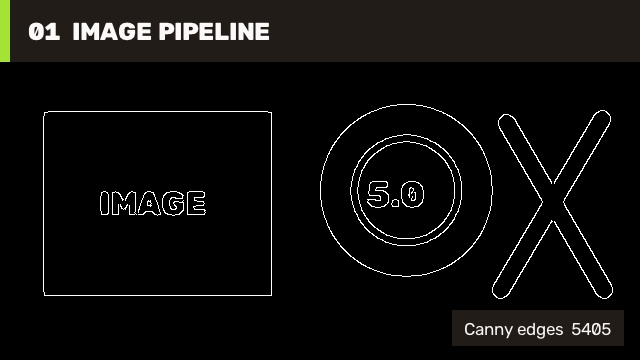

# 01 Image Pipeline / 图像流水线

This first case connects the operations used by many image services: BGR input, grayscale conversion, Gaussian filtering, Canny edge detection, statistics, channel composition, and PNG encoding.

第一个案例串联常见图像服务的基础操作：BGR 输入、灰度转换、Gaussian 滤波、Canny 边缘检测、统计、通道合并和 PNG 编码。



## Run / 运行

The complete implementation lives in [`ImageProcessing/01.ImagePipeline/Program.cs`](https://github.com/guojin-yan/OpenCV-CSharp-API/blob/opencv5.x/samples/ImageProcessing/01.ImagePipeline/Program.cs). It owns the generated input, processing chain, statistics, visualization, and file output while consuming the package fixture.

完整实现位于 [`ImageProcessing/01.ImagePipeline/Program.cs`](https://github.com/guojin-yan/OpenCV-CSharp-API/blob/opencv5.x/samples/ImageProcessing/01.ImagePipeline/Program.cs)，由该项目自行完成输入生成、处理链、统计、可视化和文件输出，并直接使用 package 夹具。

```powershell
dotnet run --project .\samples\ImageProcessing\01.ImagePipeline\ImagePipeline.csproj -c Release -- .\artifacts\tutorial-01
```

## Core Flow / 核心流程

```csharp
using var gray = new Mat();
using var blurred = new Mat();
using var edges = new Mat();

ImgProcCv2.CvtColor(source, gray, ColorConversionCodes.BGR2GRAY);
ImgProcCv2.GaussianBlur(gray, blurred, new Size(7, 7), 1.4);
ImgProcCv2.Canny(blurred, edges, 45, 135);
int edgePixels = CoreCv2.CountNonZero(edges);
using Mat preview = CoreCv2.Merge(new[] { edges, edges, edges });
ImgCodecsCv2.ImWrite("image-pipeline.png", preview);
```

`Mat` instances own native memory, so temporary matrices are disposed deterministically. The case reports the number of nonzero edge pixels, making the visual result useful as a machine-checkable smoke signal as well.

`Mat` 持有 native 内存，因此临时矩阵均进行确定性释放。案例同时输出非零边缘像素数，使可视化结果也能作为机器可检查的 smoke 信号。

This path works with mini and full runtimes. Continue with [Contours And Objects](tutorial-03-contours.md), [ImgProc Filter Transform Guide](imgproc-filter-transform-guide.md), and [ImgCodecs Boundary](imgcodecs-boundary.md).

该流程可使用 mini 或 full runtime。后续可阅读[轮廓与目标](tutorial-03-contours.md)、[ImgProc Filter Transform Guide](imgproc-filter-transform-guide.md)和 [ImgCodecs Boundary](imgcodecs-boundary.md)。
