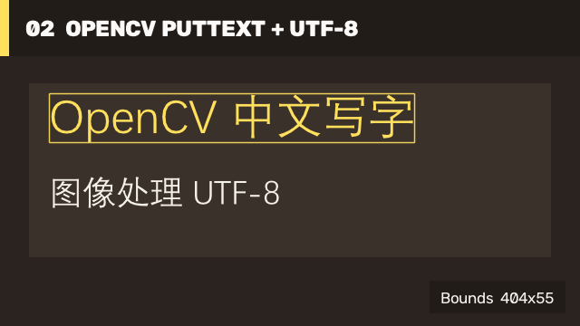

# 02 OpenCV PutText With Chinese / OpenCV 中文写字

OpenCV 5 adds a `FontFace` overload of `putText`. This binding sends the .NET string to the native API as UTF-8 and renders it directly into `Mat`. It does not use GDI, Skia, a browser canvas, or a pre-rendered text bitmap.

OpenCV 5 为 `putText` 增加了 `FontFace` 重载。本项目把 .NET 字符串以 UTF-8 传入 native API，并直接写入 `Mat`；该流程不使用 GDI、Skia、浏览器画布或预渲染文字位图。



## Run / 运行

Pass a TTF/TTC/OpenType font containing the required Chinese glyphs:

传入包含所需中文字形的 TTF/TTC/OpenType 字体：

```powershell
dotnet run --project .\samples\ConsoleSamples\ConsoleSamples.csproj -c Release `
  -p:OpenCvNativeRuntimeDir=E:\path\to\runtime `
  -- tutorial text .\artifacts\tutorial-02 C:\Windows\Fonts\Deng.ttf
```

Alternatively set `OPENCV_CSHARP_CJK_FONT`. If neither input is supplied, the sample checks known CJK font locations on Windows, Linux, and macOS and fails with an actionable message when none is found.

也可以设置 `OPENCV_CSHARP_CJK_FONT`。如果两种输入都未提供，示例会检查 Windows、Linux 和 macOS 的常见中文字体路径；找不到字体时会给出明确错误信息。

## OpenCV PutText API / OpenCV PutText 接口

```csharp
using JYPPX.OpenCvSharp;
using JYPPX.OpenCvSharp.ImgProc;
using ImgProcCv2 = JYPPX.OpenCvSharp.ImgProc.Cv2;

using var image = new Mat(240, 800, MatType.CV_8UC3, new Scalar(32, 32, 32));
using var font = new FontFace(@"C:\Windows\Fonts\Deng.ttf");

const string text = "OpenCV 中文写字";
var origin = new Point(32, 96);
Rect bounds = ImgProcCv2.GetTextSize(image.Size, text, origin, font, 42, weight: 500);
Point next = ImgProcCv2.PutText(
    image,
    text,
    origin,
    new Scalar(92, 224, 255),
    font,
    size: 42,
    weight: 500,
    flags: PutTextFlags.AlignLeft);
```

The ordinary Hershey overload remains unchanged for ASCII and its existing callers. Use the `FontFace` overload when Unicode glyph coverage matters. Font files are an application/runtime concern and are not bundled into the managed NuGet package.

原有 Hershey 重载保持不变，继续服务 ASCII 和现有调用方；需要 Unicode 字形覆盖时使用 `FontFace` 重载。字体文件属于应用或运行环境资源，不会打入 managed NuGet 包。

This path works with mini and full runtimes. See [ImgProc Boundary](imgproc-boundary.md) for the native error and ownership contract.

该流程可使用 mini 或 full runtime。native 错误与所有权约定见 [ImgProc Boundary](imgproc-boundary.md)。
