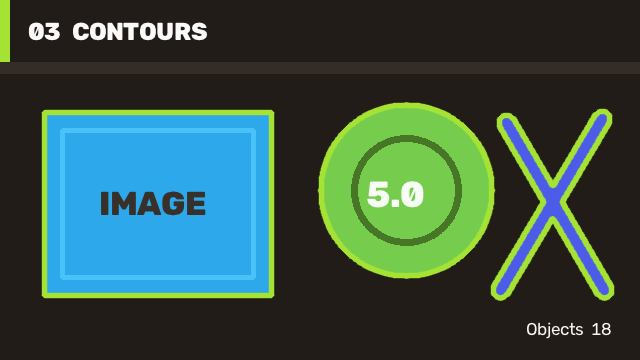

# 03 Contours And Objects / 轮廓与目标

This case turns a processed binary image into object boundaries. It demonstrates the count/fill marshalling path for jagged `Point[][]` contours and renders all external contours back onto a BGR image.

本案例把处理后的二值图像转换成目标边界，展示不规则 `Point[][]` 轮廓的 count/fill 编组路径，并把全部外轮廓绘制回 BGR 图像。



## Run / 运行

[`Case03.Contours/Program.cs`](https://github.com/guojin-yan/OpenCV-CSharp-API/blob/opencv5.x/samples/PublishedPackageSamples/Case03.Contours/Program.cs) is a complete threshold-to-object workflow: it creates input, produces a binary mask, marshals contour arrays, draws the result, and writes its own report.

[`Case03.Contours/Program.cs`](https://github.com/guojin-yan/OpenCV-CSharp-API/blob/opencv5.x/samples/PublishedPackageSamples/Case03.Contours/Program.cs) 是完整的“阈值到目标”流程：自行创建输入、生成二值图、编组轮廓数组、绘制结果并输出报告。

```powershell
dotnet run --project .\samples\PublishedPackageSamples\Case03.Contours\Case03.Contours.csproj -c Release -- .\artifacts\tutorial-03
```

## Core Flow / 核心流程

```csharp
using var gray = new Mat();
using var binary = new Mat();
ImgProcCv2.CvtColor(source, gray, ColorConversionCodes.BGR2GRAY);
ImgProcCv2.Threshold(gray, binary, 82, 255, ThresholdTypes.Binary);

ImgProcCv2.FindContours(
    binary,
    out Point[][] contours,
    out Vec4i[] hierarchy,
    RetrievalModes.External,
    ContourApproximationModes.ApproxSimple);

using Mat result = source.Clone();
ImgProcCv2.DrawContours(result, contours, -1, new Scalar(52, 226, 164), 4,
    LineTypes.AntiAlias, hierarchy);
```

Choose thresholding and morphology for the actual lighting and object scale of the application. Keep empty-contour handling explicit before downstream area, bounding-box, or shape calculations.

实际应用应根据光照和目标尺度选择阈值与形态学参数，并在面积、边界框或形状分析前显式处理空轮廓。

This path works with mini and full runtimes. Continue with [ImgProc Segmentation Contours Features Guide](imgproc-segmentation-contours-features-guide.md).

该流程可使用 mini 或 full runtime。深入内容见 [ImgProc Segmentation Contours Features Guide](imgproc-segmentation-contours-features-guide.md)。
