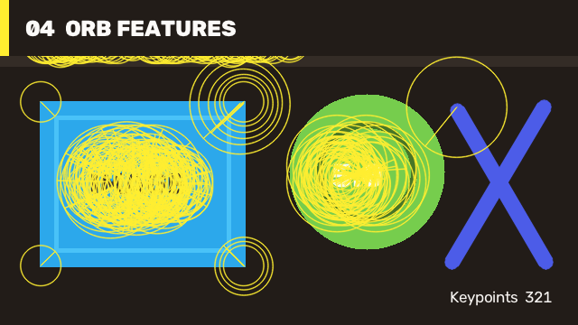

# 04 ORB Features / ORB 特征

ORB detects repeatable keypoints and creates compact binary descriptors without an external model. The tutorial also draws scale and orientation information so the result can be reviewed visually.

ORB 无需外部模型即可检测可重复关键点并生成紧凑的二进制描述子。教程还会绘制尺度与方向信息，便于直接检查结果。



## Run / 运行

[`Case04.OrbFeatures/Program.cs`](https://github.com/guojin-yan/OpenCV-CSharp-API/blob/opencv5.x/samples/PublishedPackageSamples/Case04.OrbFeatures/Program.cs) owns feature detection, descriptor generation, rich keypoint visualization, metrics, and output persistence.

[`Case04.OrbFeatures/Program.cs`](https://github.com/guojin-yan/OpenCV-CSharp-API/blob/opencv5.x/samples/PublishedPackageSamples/Case04.OrbFeatures/Program.cs) 自行完成特征检测、描述子生成、关键点可视化、指标统计和结果保存。

```powershell
dotnet run --project .\samples\PublishedPackageSamples\Case04.OrbFeatures\Case04.OrbFeatures.csproj -c Release -- .\artifacts\tutorial-04
```

## Core Flow / 核心流程

```csharp
using ORB orb = ORB.Create(maxFeatures: 320, fastThreshold: 8);
using var descriptors = new Mat();
orb.DetectAndCompute(source, null, out KeyPoint[] keypoints, descriptors);

using var result = new Mat();
Features2DCv2.DrawKeypoints(
    source,
    keypoints,
    result,
    new Scalar(48, 238, 255),
    DrawMatchesFlags.DrawRichKeypoints);
```

The output reports both keypoint count and descriptor width. Use Hamming distance for ORB descriptors, then filter matches before estimating geometry.

输出同时报告关键点数量和描述子宽度。ORB 描述子应使用 Hamming 距离，并在估计几何关系前筛选匹配结果。

This case requires a full runtime. Continue with [Features2D ORB Guide](features2d-orb-guide.md) and [Features2D Matcher Guide](features2d-matcher-guide.md).

该案例需要 full runtime。深入内容见 [Features2D ORB Guide](features2d-orb-guide.md) 和 [Features2D Matcher Guide](features2d-matcher-guide.md)。
