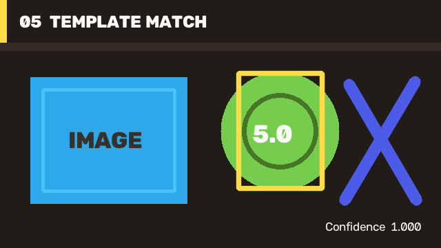

# 05 Template Matching / 模板匹配

Template matching is a compact localization workflow for fixed-scale visual targets. This case creates a template from the source, calculates a normalized response map, reads its maximum, and draws the best location.

模板匹配适用于固定尺度视觉目标的紧凑定位流程。本案例从输入中创建模板，计算归一化响应图，读取最大值并绘制最佳位置。



## Run / 运行

[`Case05.TemplateMatching/Program.cs`](https://github.com/guojin-yan/OpenCV-CSharp-API/blob/opencv5.x/samples/PublishedPackageSamples/Case05.TemplateMatching/Program.cs) owns template extraction, normalized response calculation, peak selection, result annotation, and confidence reporting.

[`Case05.TemplateMatching/Program.cs`](https://github.com/guojin-yan/OpenCV-CSharp-API/blob/opencv5.x/samples/PublishedPackageSamples/Case05.TemplateMatching/Program.cs) 自行完成模板提取、归一化响应计算、峰值选择、结果标注和置信度报告。

```powershell
dotnet run --project .\samples\PublishedPackageSamples\Case05.TemplateMatching\Case05.TemplateMatching.csproj -c Release -- .\artifacts\tutorial-05
```

## Core Flow / 核心流程

```csharp
var templateRect = new Rect(346, 106, 122, 168);
using Mat view = source.SubMat(templateRect);
using Mat template = view.Clone();
using Mat response = ImgProcCv2.MatchTemplate(
    source,
    template,
    TemplateMatchModes.CCoeffNormed);

MinMaxLocResult extrema = CoreCv2.MinMaxLoc(response);
var detected = new Rect(extrema.MaxLoc, template.Size);
ImgProcCv2.Rectangle(source, detected, new Scalar(72, 220, 255), 5);
```

The tutorial uses a perfect synthetic match and therefore reports confidence `1.000`. Real applications should establish a validation-set threshold and consider image pyramids when target scale can change.

教程使用完全一致的合成模板，因此置信度为 `1.000`。真实应用应通过验证集确定阈值；目标尺度变化时需要考虑图像金字塔。

This path works with mini and full runtimes. For feature-based alternatives, continue with [ORB Features](tutorial-04-orb-features.md).

该流程可使用 mini 或 full runtime。需要基于特征的替代方案时，继续阅读 [ORB 特征](tutorial-04-orb-features.md)。
