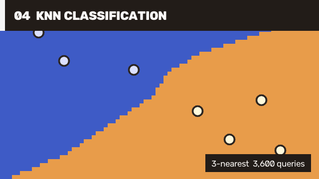

# 06 KNN Classification / KNN 分类

The final case combines OpenCV ML with image visualization when the selected runtime links the optional ML module. It trains a two-class K-nearest model, predicts 3,600 query samples in one native call, and renders the decision surface. If the runtime reports `NOT_LINKED`, the runner writes a diagnostic panel instead of failing the complete tutorial series.

当所选 runtime 链接了可选 ML 模块时，最后一个案例把 OpenCV ML 与图像可视化组合起来：训练二分类 K 近邻模型，在一次 native 调用中预测 3,600 个 query，并绘制决策面。如果 runtime 返回 `NOT_LINKED`，runner 会写出诊断面板，而不会让完整教程系列失败。



## Run / 运行

[`MachineLearning/01.KnnClassification/Program.cs`](https://github.com/guojin-yan/OpenCV-CSharp-API/blob/opencv5.x/samples/MachineLearning/01.KnnClassification/Program.cs) owns training data preparation, batch query generation, model training, prediction, decision-surface rendering, and explicit runtime capability handling.

[`MachineLearning/01.KnnClassification/Program.cs`](https://github.com/guojin-yan/OpenCV-CSharp-API/blob/opencv5.x/samples/MachineLearning/01.KnnClassification/Program.cs) 自行完成训练数据准备、批量查询生成、模型训练、预测、决策面绘制和明确的 runtime 能力处理。

```powershell
dotnet run --project .\samples\MachineLearning\01.KnnClassification\KnnClassification.csproj -c Release -- .\artifacts\tutorial-06
```

## Core Flow / 核心流程

```csharp
using var samples = new Mat(8, 2, MatType.CV_32FC1);
using var responses = new Mat(8, 1, MatType.CV_32SC1);
using var queries = new Mat(3600, 2, MatType.CV_32FC1);
using var results = new Mat();
using KNearest knn = KNearest.Create();

samples.CopyFrom<float>(trainingValues);
responses.CopyFrom<int>(trainingLabels);
queries.CopyFrom<float>(queryValues);
knn.DefaultK = 3;
knn.IsClassifierModel = true;
knn.Train(samples, SampleTypes.RowSample, responses);
knn.FindNearest(queries, 3, results);
float[] labels = results.ToArray<float>();
```

Production code should control feature normalization, label type, train/test separation, validation metrics, and persisted model provenance. Batch prediction avoids a managed/native transition for every sample.

生产代码需要控制特征归一化、标签类型、训练/测试划分、验证指标和持久化模型来源。批量预测可以避免每个样本都发生一次 managed/native 切换。

This case needs a full runtime with the ML module linked. The first public `win-x64` preview may report `NOT_LINKED` for ML because optional modules are staged independently; use the output marker to distinguish capability from an application error. Continue with [ML Guide](ml-guide.md) for SVM, trees, boosting, EM, logistic regression, and neural-network APIs.

该案例需要链接 ML 模块的 full runtime。首版公开 `win-x64` preview 的可选模块可能返回 `NOT_LINKED`；请根据输出标记区分 runtime 能力和应用错误。SVM、trees、boosting、EM、logistic regression 和神经网络 API 见 [ML Guide](ml-guide.md)。
