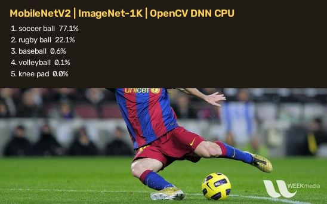

# 18 MobileNetV2 Image Classification / MobileNetV2 图像分类

This workflow downloads a verified OpenCV Zoo MobileNetV2 model, classifies a real image against 1,000 ImageNet classes, applies softmax, and renders the top five predictions.

本案例下载经过校验的 OpenCV Zoo MobileNetV2 模型，对真实图片执行 ImageNet 1000 类分类，完成 Softmax 归一化并绘制置信度最高的五个结果。



## Run / 运行

```powershell
pwsh .\scripts\Get-SampleModelAssets.ps1 -Bundle classification-mobilenet-v2
dotnet run --project .\samples\DeepLearning\02.ImageClassification\ImageClassification.csproj -c Release
```

The example needs a Full runtime with DNN. The sample project pins a published package fixture only for repository regression; normal applications should install `JYPPX.OpenCV.CSharp.API` and the matching runtime without writing a version into source commands.

案例需要包含 DNN 的 Full runtime。仓库案例项目固定已发布包仅用于回归验证；普通应用安装 `JYPPX.OpenCV.CSharp.API` 和匹配的 runtime 时，不应在源码命令中写死版本。

## Pipeline / 流程

1. Resolve and revalidate the model, label file, image, and license from the asset manifest.
2. Resize to `256x256`, take the centered `224x224` crop, swap BGR to RGB, and apply ImageNet mean/standard-deviation normalization.
3. Load ONNX with `Net.ReadNetFromOnnx`, select OpenCV CPU execution, bind the blob, and call `Forward`.
4. Require exactly 1,000 output scores, apply a numerically stable softmax, and select the top five labels.
5. Write `image-classification.png` and print the top-1 class, confidence, and inference time.

1. 从资产清单解析模型、标签、图片和许可证，并再次校验文件。
2. 缩放到 `256x256`，截取中心 `224x224` 区域，完成 BGR 到 RGB 通道交换以及 ImageNet 均值/标准差归一化。
3. 使用 `Net.ReadNetFromOnnx` 加载 ONNX，选择 OpenCV CPU 后端，绑定 blob 并执行 `Forward`。
4. 强制检查输出必须为 1000 个分数，执行数值稳定的 Softmax，再选取前五个类别。
5. 生成 `image-classification.png`，并输出 Top-1 类别、置信度和推理耗时。

## Acceptance / 验收

With the pinned fixture, the top result is `soccer ball` at about 77% probability. A label count other than 1,000, an asset hash mismatch, an empty image, or an unexpected output shape fails the process immediately.

固定测试数据的 Top-1 结果应为 `soccer ball`，概率约 77%。标签数不是 1000、资产哈希不一致、图片为空或输出形状异常时，程序会立即失败。

For production, keep preprocessing coupled to model metadata. Changing crop policy, channel order, mean, or standard deviation can invalidate accuracy even when inference itself succeeds.

用于生产时，预处理参数必须与模型元数据一起管理。裁剪策略、通道顺序、均值或标准差发生变化，即使推理调用成功，也可能破坏准确率。

Related: [Sample Model Assets](sample-model-assets-guide.md), [DNN Net Guide](dnn-net-guide.md).
