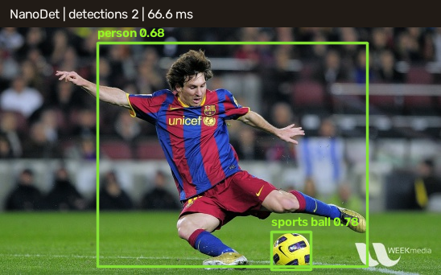

# 19 NanoDet Object Detection / NanoDet 目标检测

This example implements the complete NanoDet deployment path: letterbox preprocessing, multi-level tensor validation, distribution-based box decoding, confidence filtering, non-maximum suppression, coordinate restoration, and visualization.

本案例实现 NanoDet 的完整部署流程：等比例填充、多层输出校验、分布式边框解码、置信度过滤、非极大值抑制、坐标还原和结果绘制。



## Run / 运行

```powershell
pwsh .\scripts\Get-SampleModelAssets.ps1 -Bundle detection-nanodet
dotnet run --project .\samples\DeepLearning\03.ObjectDetection\ObjectDetection.csproj -c Release
```

## Pipeline / 流程

The input is letterboxed to `416x416`. `Image2BlobParams` swaps BGR to RGB and applies the model mean and scale. The pinned ONNX model exposes six tensors: classification and box-distribution tensors for strides 8, 16, and 32.

输入图片按比例填充到 `416x416`。`Image2BlobParams` 完成 BGR 到 RGB 交换并应用模型均值和缩放参数。固定 ONNX 模型实际输出六个张量，分别对应步长 8、16、32 的分类和边框分布。

For every grid location, the implementation:

1. selects the best of 80 COCO classes;
2. rejects scores below `0.45`;
3. applies softmax to each 8-bin left/top/right/bottom distribution;
4. converts the expected distance into a box at the current stride;
5. maps the box through the inverse letterbox transform; and
6. runs IoU-based NMS at `0.60`.

每个网格位置都会选择 80 个 COCO 类别中的最高分，过滤低于 `0.45` 的结果，对四个方向的 8 档分布执行 Softmax，按当前步长解码边框，再逆向映射回原图坐标，最后用 `0.60` IoU 阈值执行 NMS。

## Acceptance / 验收

The pinned image produces two high-confidence detections: one `person` and one `sports ball`. The example validates all tensor lengths before decoding, which turns a changed model export into a clear contract error instead of incorrect boxes.

固定图片应得到两个高置信度目标：`person` 和 `sports ball`。程序在解码前严格校验所有张量长度；模型导出结构变化时会报告明确的契约错误，而不是绘制错误边框。

When adapting another detector, treat preprocessing and postprocessing as part of the model contract. Do not assume that two ONNX files with similar names share output ordering, stride levels, class count, or box encoding.

替换其他检测模型时，必须把预处理和后处理视为模型契约的一部分。名称相似的两个 ONNX 文件不一定具有相同的输出顺序、步长层级、类别数量或边框编码。

Related: [Sample Model Assets](sample-model-assets-guide.md), [DNN Advanced Guide](dnn-net-advanced-guide.md).
