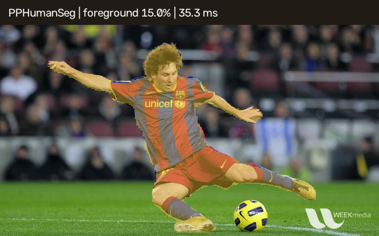

# 20 PPHumanSeg Portrait Segmentation / PPHumanSeg 人像分割

This workflow runs a verified PPHumanSeg ONNX model, converts its two-class output into a binary portrait mask, resizes the mask to the source image, and produces both a composited visualization and a reusable mask.

本案例运行经过校验的 PPHumanSeg ONNX 模型，把双类别输出转换为人像二值掩码，恢复到原图尺寸，并同时生成合成预览图和可复用掩码。



## Run / 运行

```powershell
pwsh .\scripts\Get-SampleModelAssets.ps1 -Bundle segmentation-pphumanseg
dotnet run --project .\samples\DeepLearning\04.HumanSegmentation\HumanSegmentation.csproj -c Release
```

## Pipeline / 流程

1. Resize the input to `192x192` and normalize RGB values to approximately `[-1, 1]`.
2. Execute OpenCV DNN on CPU and require exactly two `192x192` score planes.
3. Compare background and foreground scores for every pixel to create a `CV_8UC1` mask.
4. Resize with nearest-neighbor interpolation so class boundaries are not blended.
5. Use the mask to color the person, blend it with the original image, and write `human-mask.png` plus `human-segmentation.png`.

1. 把输入缩放到 `192x192`，将 RGB 数值归一化到约 `[-1, 1]`。
2. 使用 OpenCV DNN CPU 推理，并要求输出严格包含两个 `192x192` 分数平面。
3. 逐像素比较背景和前景分数，生成 `CV_8UC1` 掩码。
4. 使用最近邻插值恢复原图尺寸，避免类别边界被混合。
5. 用掩码给人物着色并与原图融合，输出 `human-mask.png` 和 `human-segmentation.png`。

## Acceptance / 验收

The pinned fixture yields about 28,000 foreground pixels, roughly 15% of the image. A zero mask, an all-image mask, or an output length other than `2 * 192 * 192` should be treated as a preprocessing or model-contract failure.

固定数据应得到约 2.8 万个前景像素，约占整张图片的 15%。空掩码、全图掩码或输出长度不是 `2 * 192 * 192`，都应视为预处理或模型契约错误。

The binary mask can feed background replacement, privacy blur, virtual-camera composition, or downstream measurement. Keep the original mask separate from presentation effects.

二值掩码可以继续用于背景替换、隐私模糊、虚拟摄像头合成或后续测量。生产代码应把原始掩码与展示效果分开保存。

Related: [Sample Model Assets](sample-model-assets-guide.md), [Core Array Operations](core-array-ops-guide.md).
