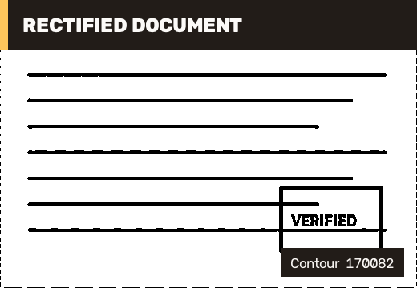

# 21 Document Scanner / 文档扫描与透视矫正

This example turns a photographed page into a clean, front-facing document. It detects the paper boundary from image content, orders the four corners, computes a homography, rectifies the page, and applies adaptive thresholding.

本案例把倾斜拍摄的纸张转换为正视扫描件。程序从图像内容中检测纸张边界，排序四个角点，计算单应矩阵，完成透视矫正并应用自适应阈值。



## Run / 运行

```powershell
dotnet run --project .\samples\Geometry\03.DocumentScanner\DocumentScanner.csproj -c Release
```

The sample generates a deterministic photographed-document scene, so it can run in CI without a camera or test image. Replacing `CreateDocumentScene` with `ImgCodecs.Cv2.ImRead` is the only input-layer change needed for a real photograph.

案例生成确定性的“拍摄文档”场景，因此无需摄像头或外部图片即可在 CI 中运行。用于真实照片时，只需把 `CreateDocumentScene` 替换为 `ImgCodecs.Cv2.ImRead`。

## Pipeline / 流程

1. Convert to grayscale, apply a `5x5` Gaussian blur, and run Canny edge detection.
2. Find contours, approximate each closed contour with Douglas-Peucker, and select the largest convex quadrilateral above the area threshold.
3. Order corners as top-left, top-right, bottom-right, bottom-left using coordinate sums and differences.
4. Compute `GetPerspectiveTransform` and warp to a stable `520x360` document plane.
5. Convert to grayscale and use Gaussian adaptive thresholding to produce a high-contrast scan.

1. 转灰度、执行 `5x5` 高斯模糊，再运行 Canny 边缘检测。
2. 查找轮廓，使用 Douglas-Peucker 逼近闭合轮廓，并选择面积阈值以上的最大凸四边形。
3. 通过坐标和与坐标差，把角点排序为左上、右上、右下、左下。
4. 使用 `GetPerspectiveTransform` 计算变换，并矫正到稳定的 `520x360` 文档平面。
5. 再次转灰度，使用高斯自适应阈值得到高对比度扫描件。

## Acceptance / 验收

The generated scene must produce exactly four selected corners and a non-empty `520x360` output. Production scanners should add minimum-angle checks, page aspect-ratio policy, glare detection, and a manual corner-adjustment fallback.

生成场景必须选出四个角点并输出非空的 `520x360` 图像。生产扫描器还应增加最小夹角检查、纸张宽高比策略、反光检测，以及手动调整角点的回退界面。

Related: [ImgProc Geometry Guide](imgproc-geometry-guide.md), [Contours And Objects](tutorial-03-contours.md).
