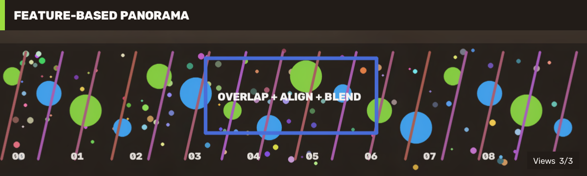

# 22 Feature-Based Panorama Stitching / 基于特征的全景拼接

This workflow creates three overlapping camera views, estimates their geometric relationship, blends seams, and requires OpenCV Stitcher to retain all three inputs in one panorama.

本案例生成三张具有重叠区域的相机视图，估计视图间几何关系，融合接缝，并强制要求 OpenCV Stitcher 把三张输入全部纳入全景图。



## Run / 运行

```powershell
dotnet run --project .\samples\Stitching\01.PanoramaStitching\PanoramaStitching.csproj -c Release
```

This case requires the Full runtime because it uses the high-level Stitching module and its feature, geometry, and blending dependencies.

本案例需要 Full runtime，因为高层 Stitching 模块依赖特征、几何估计和图像融合能力。

## Pipeline / 流程

The deterministic source contains unique point features, lines, shapes, and text. Three `640x360` crops are taken at horizontal offsets 0, 280, and 560, providing 360-pixel overlap between neighbors. `StitcherMode.Panorama` performs feature matching, camera estimation, warping, seam estimation, exposure handling, and composition.

确定性场景包含唯一散点、直线、形状和文字。程序在水平偏移 0、280、560 处截取三张 `640x360` 视图，相邻视图重叠 360 像素。`StitcherMode.Panorama` 完成特征匹配、相机估计、变换、接缝估计、曝光处理和合成。

The example treats both conditions as mandatory:

- `StitcherStatus.OK` and a non-empty panorama;
- `GetComponent()` reports all three input views.

案例同时要求 `StitcherStatus.OK`、输出非空，并要求 `GetComponent()` 报告三张输入全部参与。仅仅生成一张局部全景图不算通过。

## Acceptance / 验收

The current fixture produces a panorama about `1198x360` from all `3/3` views. Real capture should lock focus/exposure when possible, preserve 30-50% overlap, avoid pure rotation plus strong nearby parallax, and reject frames with insufficient texture or motion blur.

当前数据使用 `3/3` 视图，生成约 `1198x360` 的全景图。真实拍摄应尽量锁定焦距和曝光，保留 30%-50% 重叠，避免近景强视差，并拒绝纹理不足或运动模糊的帧。

Related: [Stitching Stitcher Guide](stitching-stitcher-guide.md), [Feature Homography](tutorial-13-feature-homography.md).
