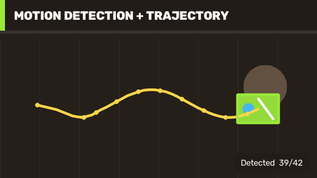

# 23 Motion Analysis And Trajectory / 运动分析与轨迹提取

This example processes a complete frame sequence rather than a single API call. It learns a background model, extracts foreground motion, cleans the mask, filters contours, and builds a trajectory from detected object centers.

本案例处理完整帧序列，而不是演示单个接口。程序学习背景模型，提取运动前景，清理掩码，筛选目标轮廓，并根据检测框中心生成运动轨迹。



## Run / 运行

```powershell
dotnet run --project .\samples\Video\03.MotionAnalysis\MotionAnalysis.csproj -c Release
```

## Pipeline / 流程

1. Generate 42 frames with a moving textured target and static distractors.
2. Apply MOG2 with a fast warm-up learning rate, then reduce the rate for stable foreground detection.
3. Use elliptical opening and closing to remove isolated noise and fill target gaps.
4. Find external contours, reject implausibly small or large regions, and keep the largest valid moving target.
5. Convert bounding boxes to center points, retain temporal order, and draw the trajectory over the final frame.

1. 生成 42 帧序列，包含一个带纹理的运动目标和多个静态干扰物。
2. 使用 MOG2 建模；预热阶段采用较快学习率，随后降低学习率以稳定检测前景。
3. 使用椭圆结构元素执行开运算和闭运算，去除孤立噪声并填补目标内部空洞。
4. 查找外部轮廓，过滤面积过小或过大的区域，保留最大的有效运动目标。
5. 把检测框转换为中心点，按时间顺序保存并在最终帧绘制轨迹。

## Acceptance / 验收

The deterministic sequence currently yields 39 detections from 42 frames and a continuous 39-point trajectory. The first frames are intentionally allowed to be missing while the background model warms up.

确定性序列当前在 42 帧中检测到 39 帧，并形成连续的 39 点轨迹。背景模型预热期间允许最初几帧没有有效检测。

For a real camera, tune history, variance threshold, learning rate, morphology kernel, area range, and region-of-interest together. Add track association when multiple moving objects can appear.

用于真实摄像头时，应联合调整历史长度、方差阈值、学习率、形态学核、面积范围和 ROI。可能出现多个运动目标时，还需要增加跨帧关联。

Related: [Video Background Subtractor Guide](video-background-subtractor-guide.md), [Optical Flow](tutorial-15-optical-flow.md).
