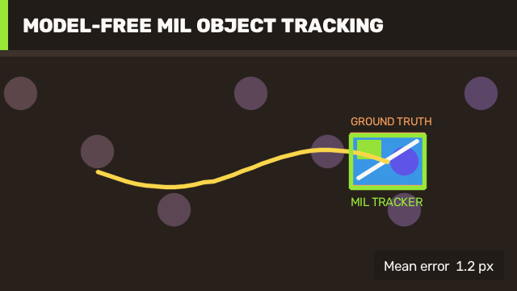

# 24 MIL Object Tracking / MIL 单目标跟踪

This workflow initializes OpenCV's model-free MIL tracker from one known rectangle, updates it through a generated sequence, compares every estimate with ground truth, and reports quantitative tracking error.

本案例使用一个已知初始框初始化 OpenCV 无外部模型的 MIL 跟踪器，逐帧更新目标位置，与真实位置比较，并输出量化跟踪误差。



## Run / 运行

```powershell
dotnet run --project .\samples\Tracking\01.MilObjectTracking\MilObjectTracking.csproj -c Release
```

The example uses `JYPPX.OpenCvSharp.Video.TrackerMIL` from OpenCV's main Video module. It does not require an ONNX model or the optional contrib Tracking module.

案例使用 OpenCV 主 Video 模块中的 `JYPPX.OpenCvSharp.Video.TrackerMIL`，不需要 ONNX 模型，也不依赖可选的 contrib Tracking 模块。

## Pipeline / 流程

1. Generate a textured target over a static but visually nontrivial background.
2. Call `TrackerMIL.Create`, then initialize exactly once with the first frame and target rectangle.
3. Pass each subsequent frame to `Update` using a rectangle by reference.
4. Store the estimated center, compare it with the known center, and collect per-frame Euclidean error.
5. Draw the estimated trajectory, final ground-truth box, final tracker box, update count, mean error, maximum error, and tracker score.

1. 在具有静态干扰纹理的背景上生成带特征的目标。
2. 调用 `TrackerMIL.Create`，使用第一帧和初始目标框完成一次初始化。
3. 后续每帧通过引用矩形调用 `Update`。
4. 保存估计中心，与已知真实中心比较，记录逐帧欧氏距离误差。
5. 绘制估计轨迹、最终真实框、最终跟踪框，并输出更新次数、平均误差、最大误差和跟踪分数。

## Acceptance / 验收

The current 32-frame fixture completes all 31 updates, with mean center error around 1.2 pixels and maximum error around 2 pixels. The sample fails when fewer than 24 updates succeed, preventing a mostly-lost tracker from producing a misleading success image.

当前 32 帧数据完成全部 31 次更新，中心平均误差约 1.2 像素，最大误差约 2 像素。成功更新少于 24 次时案例会失败，避免跟踪器大部分时间丢失却仍生成误导性的“成功”图片。

Production systems should add a confidence policy, lost-target recovery, re-detection, frame timestamps, and explicit handling for resolution changes. A tracker is not a detector: it needs an initial target and should not be expected to recover indefinitely after occlusion.

生产系统还应增加置信度策略、目标丢失恢复、重新检测、帧时间戳和分辨率变化处理。跟踪器不是检测器：它需要初始目标，遮挡后也不能无限期自行恢复。

Related: [Tracking Guide](tracking-guide.md), [Video Motion Guide](video-motion-guide.md).
