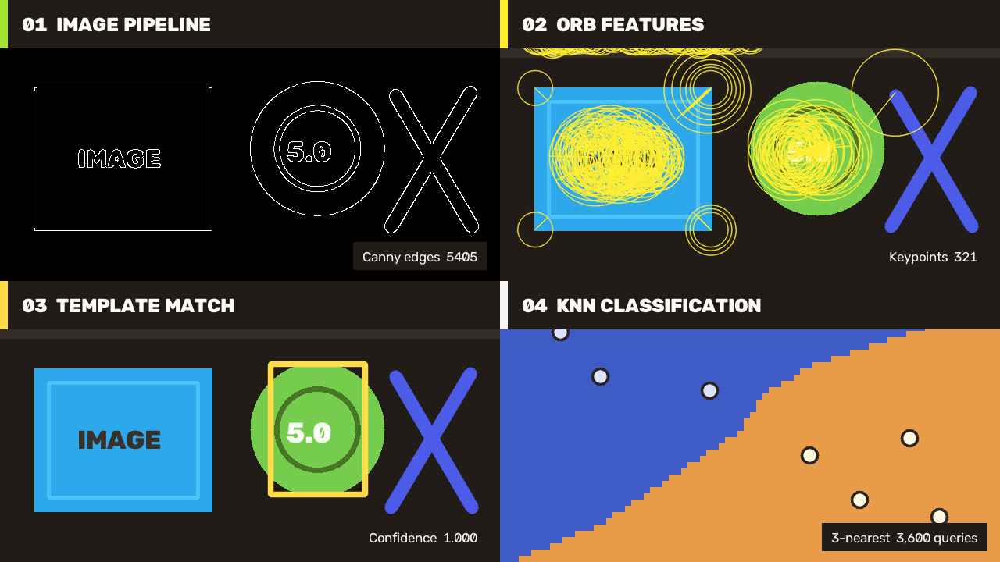

# OpenCV CSharp API

Welcome to the OpenCV CSharp API documentation.

欢迎阅读 OpenCV CSharp API 文档。

## First Release / 首版

The first release is organized around useful end-to-end workflows while the broader OpenCV surface continues to evolve under stable managed API and native ABI baselines.

首版以可直接使用的端到端工作流为中心，更广泛的 OpenCV 接口将在稳定的 managed API 与 native ABI 基线下持续迭代。

- [First Release Overview](articles/first-release-overview.md)
- [Visual Showcase](articles/visual-showcase.md)
- [Scenario Recipes](articles/scenario-recipes.md)
- [Quick Start](articles/quick-start.md)

## Release Readiness / 发布准备

- [Version-Neutral Naming Guide](articles/version-neutral-naming-guide.md)
- [Linked Runtime Build Guide](articles/linked-runtime-build-guide.md)
- [Linked Runtime Smoke Guide](articles/linked-runtime-smoke-guide.md)
- [Smoke Profiles Guide](articles/smoke-profiles-guide.md)
- [Runtime Licenses](articles/runtime-licenses.md)
- [Runtime Package Staging Notes](articles/linked-runtime-build-guide.md#pack-runtime--打包-runtime)

## Start Here / 从这里开始

- [Quick Start](articles/quick-start.md)
- [First Release Overview](articles/first-release-overview.md)
- [Visual Showcase](articles/visual-showcase.md)
- [Scenario Recipes](articles/scenario-recipes.md)
- [Version-Neutral Naming Guide](articles/version-neutral-naming-guide.md)
- [Native ABI Plan](articles/native-module-boundary.md)
- [Mat Object Model](articles/mat-object-model.md)
- [MatType Constants](articles/mat-type-constants.md)
- [Mat Data Access](articles/mat-data-access.md)
- [Core Array Operations Guide](articles/core-array-ops-guide.md)
- [Core Channel Layout Guide](articles/core-channel-layout-guide.md)
- [Core Linear Algebra Guide](articles/core-linear-algebra-guide.md)
- [Core Decomposition Objects Guide](articles/core-decomposition-objects-guide.md)
- [Core Spectral Transform Guide](articles/core-spectral-transform-guide.md)
- [ImgProc Filter Transform Guide](articles/imgproc-filter-transform-guide.md)
- [ImgProc Segmentation Contours Features Guide](articles/imgproc-segmentation-contours-features-guide.md)
- [ImgProc Hough Features CLAHE Guide](articles/imgproc-hough-features-clahe-guide.md)
- [Features2D Boundary](articles/features2d-boundary.md)
- [Feature2D Common Guide](articles/feature2d-common-guide.md)
- [Features2D ORB Guide](articles/features2d-orb-guide.md)
- [Features2D Detectors Guide](articles/features2d-detectors-guide.md)
- [Features2D BRISK KAZE AKAZE Guide](articles/features2d-brisk-kaze-akaze-guide.md)
- [Features2D Batch Detect Guide](articles/features2d-batch-detect-guide.md)
- [Features2D AffineFeature Guide](articles/features2d-affine-guide.md)
- [Features2D Blob And Region Detectors Guide](articles/features2d-blob-region-detectors-guide.md)
- [Features2D SimpleBlobDetector Guide](articles/features2d-simpleblob-guide.md)
- [Features2D Matcher Guide](articles/features2d-matcher-guide.md)
- [Calib3D Geometry Guide](articles/calib3d-geometry-guide.md)
- [Calib3D Calibration Pattern Guide](articles/calib3d-calibration-guide.md)
- [Calib3D Full Calibration Guide](articles/calib3d-full-calibration-guide.md)
- [Calib3D Stereo Calibration Guide](articles/calib3d-stereo-calibration-guide.md)
- [Calib3D StereoBM Guide](articles/calib3d-stereo-guide.md)
- [VideoIO Guide](articles/videoio-guide.md)
- [VideoIO Registry Guide](articles/videoio-registry-guide.md)
- [Video Motion Guide](articles/video-motion-guide.md)
- [Video Background Subtractor Guide](articles/video-background-subtractor-guide.md)
- [Video Motion Template Guide](articles/video-motion-template-guide.md)
- [Video Kalman Guide](articles/video-kalman-guide.md)
- [Video Optical Flow IO Guide](articles/video-optical-flow-io-guide.md)
- [OptFlow Guide](articles/optflow-guide.md)
- [XImgProc Guide](articles/ximgproc-guide.md)
- [XImgProc Disparity Guide](articles/ximgproc-disparity-guide.md)
- [XImgProc Sparse Interpolation Guide](articles/ximgproc-sparse-interpolation-guide.md)
- [XImgProc Edge Guide](articles/ximgproc-edge-guide.md)
- [XImgProc Filter Utilities Guide](articles/ximgproc-filter-utilities-guide.md)
- [XImgProc Fourier Guide](articles/ximgproc-fourier-guide.md)
- [XImgProc Segmentation Guide](articles/ximgproc-segmentation-guide.md)
- [XImgProc Run-Length Morphology Guide](articles/ximgproc-run-length-morphology-guide.md)
- [BgSegm Guide](articles/bgsegm-guide.md)
- [Tracking Guide](articles/tracking-guide.md)
- [Face Guide](articles/face-guide.md)
- [Face Alignment Guide](articles/face-alignment-guide.md)
- [Face MACE Guide](articles/face-mace-guide.md)
- [Saliency Guide](articles/saliency-guide.md)
- [Saliency Objectness Guide](articles/saliency-objectness-guide.md)
- [DNN Net Guide](articles/dnn-net-guide.md)
- [DNN Net Advanced Guide](articles/dnn-net-advanced-guide.md)
- [DNN Structured Parity Guide](articles/dnn-structured-parity-guide.md)
- [Features Upstream Coverage And ANNIndex Guide](articles/features-upstream-parity-guide.md)
- [HighGui Guide](articles/highgui-guide.md)
- [HighGui Interaction Guide](articles/highgui-interaction-guide.md)
- [Stitching Stitcher Guide](articles/stitching-stitcher-guide.md)
- [Stitching Runtime Guide](articles/stitching-runtime-guide.md)
- [ObjDetect Guide](articles/objdetect-guide.md)
- [ObjDetect Second Batch Guide](articles/objdetect-second-batch-guide.md)
- [ArUco Guide](articles/aruco-guide.md)
- [ArUco Refine Guide](articles/aruco-refine-guide.md)
- [ChArUco Guide](articles/charuco-guide.md)
- [MCC Checker Guide](articles/mcc-checker-guide.md)
- [Charuco And MCC Guide](articles/charuco-mcc-guide.md)
- [Point-Set Marshalling Guide](articles/point-set-marshalling-guide.md)
- [Photo Guide](articles/photo-guide.md)
- [Photo Second Batch Guide](articles/photo-second-batch-guide.md)
- [Photo Multi-Frame Denoise Guide](articles/photo-multiframe-denoise-guide.md)
- [PtCloud Guide](articles/ptcloud-guide.md)
- [Quality Guide](articles/quality-guide.md)
- [XPhoto Guide](articles/xphoto-guide.md)
- [ML Guide](articles/ml-guide.md)
- [ImgHash Guide](articles/img-hash-guide.md)
- [Plot Guide](articles/plot-guide.md)
- [Shape Guide](articles/shape-guide.md)
- [LineDescriptor Guide](articles/line-descriptor-guide.md)
- [Phase Unwrapping Guide](articles/phase-unwrapping-guide.md)
- [Structured Light Guide](articles/structured-light-guide.md)
- [Intensity Transform Guide](articles/intensity-transform-guide.md)
- [Fuzzy Guide](articles/fuzzy-guide.md)
- [HFS Guide](articles/hfs-guide.md)
- [Reg Guide](articles/reg-guide.md)
- [Surface Matching Guide](articles/surface-matching-guide.md)
- [RAPID Guide](articles/rapid-guide.md)
- [AlphaMat Guide](articles/alphamat-guide.md)
- [BioInspired Guide](articles/bioinspired-guide.md)
- [XStereo Guide](articles/xstereo-guide.md)
- [Linked Runtime Build Guide](articles/linked-runtime-build-guide.md)
- [Smoke Profiles Guide](articles/smoke-profiles-guide.md)
- [Linked Runtime Smoke Guide](articles/linked-runtime-smoke-guide.md)
- [XObjDetect Guide](articles/xobjdetect-guide.md)
